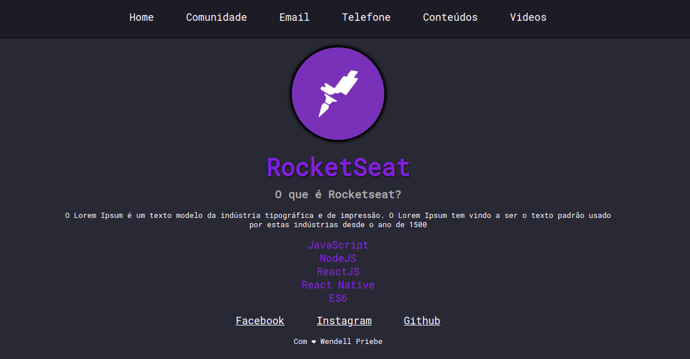

Aplicação web desenvolvida como estudo no curso Launchbase 2.0 realizado pela Rocketseat. A aplicação foi desenvolvida tendo como base conhecimentos básicos de HTML, CSS, Nunjucks, JavaScript, NodeJS e ExpressJS.

